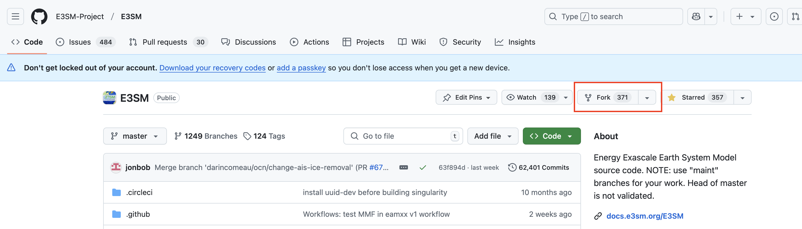

1. Fork E3SM
[E3SM git repo](https://github.com/E3SM-Project/E3SM)


2. Cloning your forked E3SM
```
git clone https://github.com/your-github-username/E3SM.git e3sm_test
cd e3sm_test
git fetch origin
git checkout origin/master
git submodule update --init --recursive
```
Note: Need to setup SSH key for Github: https://help.github.com/en/github/authenticating-to-github/generating-a-new-ssh-key-and-adding-it-to-the-ssh-agent Note: May need to do chmod 600 ~/.ssh/config

3. land-river coupled configuration for [NLDAS](https://ldas.gsfc.nasa.gov/nldas/specifications) domain

``RES=NLDAS_NLDAS #Define RESolution``
``COMPSET=IELM #Define configuration``
long name: 2000_DATM%QIA_ELM%SPBC_SICE_SOCN_MOSART_SGLC_SWAV
``MACH=compy #Define MACHine``
``COMPILER=intel #Define compiler``
``PROJECT=esmd #Define project``
``SRC_DIR=~/e3sm_test #Define E3SM directory``
``CASE_DIR=${SRC_DIR}/cime/scripts #Define the case directory``
``cd ${SRC_DIR}/cime/scripts``
`` GIT_HASH=`git log -n 1 --format=%h` ``
`` CASE_NAME=ELMMOS_NLDAS_${GIT_HASH}.`date "+%Y-%m-%d-%H%M%S"` ``

Create case
```
./create_newcase \
-case ${CASE_NAME} \
-res ${RES} \
-mach ${MACH} \
-compiler ${COMPILER} \
-compset ${COMPSET} --project ${PROJECT}
```

Configure case
```
cd ${CASE_DIR}/${CASE_NAME}

./xmlchange -file env_run.xml -id DOUT_S             -val FALSE
./xmlchange -file env_run.xml -id INFO_DBUG          -val 2
./xmlchange DEBUG=1

# Specify which DATM forcing to use
# ./xmlchange DATM_MODE=CLMMOSARTTEST 

# Specify the simualtion start time
./xmlchange DATM_CLMNCEP_YR_START=1979
./xmlchange DATM_CLMNCEP_YR_ALIGN=1979
./xmlchange DATM_CLMNCEP_YR_END=2000
./xmlchange RUN_STARTDATE=1979-01-01

./xmlchange PIO_BUFFER_SIZE_LIMIT=67108864
# If need to run for longer period
#./xmlchange STOP_N=41,STOP_OPTION=nyears #ndays, nmonths
#./xmlchange JOB_QUEUE=slurm
#./xmlchange REST_N=10,REST_OPTION=nyears
#./xmlchange RESUBMIT=1
#./xmlchange JOB_WALLCLOCK_TIME=24:00:00


#cat >> user_nl_elm << EOF
#fsurdat = '/compyfs/inputdata/lnd/clm2/surfdata_map/surfdata_nldas2_simyr2000_c181207.nc'
#EOF
cat >> user_nl_mosart << EOF
frivinp_mesh = 'UNDEFINED'
rtmhist_nhtfrq = -24
rtmhist_mfilt = 1
EOF

./case.setup

./case.build

./case.submit
```
MOSART features:
#inundflag = .true.
#routingmethod = 2
#opt_elevprof = 1
https://ncar.github.io/CESM-Tutorial/notebooks/namelist/output/output_clm.html
ELM outputs: QOVER: surface runoff
             QDRAI: subsurface runoff
             QRUNOFF: total runoff
             ZWT: ground water table
MOSART outputs: RIVER_DISCHARGE_OVER_LAND_LIQ: river discharge on land grid cells
			    RIVER_DISCHARGE_TO_OCEAN_LIQ: river discharge on river mouth cells
			    FLOODPLAIN_FRACTION: floodplain inundation fraction (if inundation is turned on)
                FLOODED_FRACTION: floodplain fraction + river area

sacct to check the status of job.

4. Only river configuration

``RES=NLDAS_NLDAS #Define RESolution``
``COMPSET=RMOSGPCC #Define configuration``
long name: 2000_DATM%QIA_DLND%GPCC_SICE_SOCN_MOSART_SGLC_SWAV
``MACH=compy #Define MACHine``
``COMPILER=intel #Define compiler``
``PROJECT=esmd #Define project``
``SRC_DIR=~/e3sm_test #Define E3SM directory``
``CASE_DIR=${SRC_DIR}/cime/scripts #Define the case directory``
``cd ${SRC_DIR}/cime/scripts``
`` GIT_HASH=`git log -n 1 --format=%h` ``
`` CASE_NAME=MOS_NLDAS_${GIT_HASH}.`date "+%Y-%m-%d-%H%M%S"` ``

./xmlchange DATM_CLMNCEP_YR_START=1979
./xmlchange DATM_CLMNCEP_YR_ALIGN=1979
./xmlchange DATM_CLMNCEP_YR_END=2000
./xmlchange DLND_CPLHIST_YR_START=1979
./xmlchange DLND_CPLHIST_YR_ALIGN=1979
./xmlchange DLND_CPLHIST_YR_END=2000
./xmlchange RUN_STARTDATE=1979-01-01

cat >> user_nl_mosart << EOF
frivinp_mesh = 'UNDEFINED'
rtmhist_nhtfrq = -24
rtmhist_mfilt = 1
EOF

5. User costumize configuration
``RES=ELMMOS_USRDAT``
``RES=MOS_USRDAT``